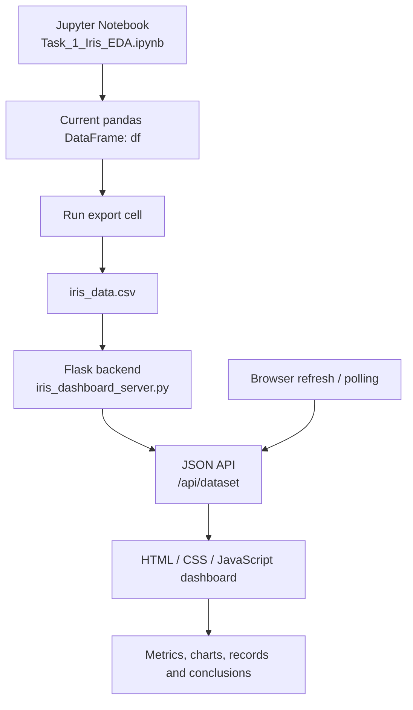

<div align="center">

# 🌸 IrisLab — Bloom & Explore

### An interactive, flower-themed Exploratory Data Analysis dashboard for the Iris dataset

**Explore distributions, compare species, investigate feature relationships, and turn visual evidence into clear conclusions.**


</div>

---

## 🌷 Table of contents

- [Project at a glance](#-project-at-a-glance)
- [The problem this project solves](#-the-problem-this-project-solves)
- [Features and visualizations](#-features-and-visualizations)
- [Technology choices: what, where, and why](#-technology-choices-what-where-and-why)
- [How the application works](#-how-the-application-works)
- [Run locally](#-run-locally)
- [Refresh the dashboard with notebook changes](#-refresh-the-dashboard-with-notebook-changes)
- [Project structure](#-project-structure)
- [Deploying online](#-deploying-online)
- [Limitations and next steps](#-limitations-and-next-steps)
- [Learning outcomes](#-learning-outcomes)

<details>
<summary><strong>🌱 Project at a glance</strong></summary>

IrisLab is a small data-science portfolio project built around the classic Iris flower dataset. It combines a Jupyter notebook for analysis with a browser-based dashboard served by a Python/Flask backend.

The notebook is the analysis workspace. The dashboard is the presentation layer: it displays dataset summaries and plots using data served by the backend. A CSV file acts as the bridge between the notebook's in-memory DataFrame and the separately running web application.

**Intended audience:** recruiters, data analysts, data-science learners, and anyone who wants to inspect the Iris dataset visually.

</details>

## 🎯 The problem this project solves

A notebook is excellent for documenting analysis, but its cells and plots can be difficult for a non-technical viewer to explore as one cohesive story. A static screenshot also becomes stale when the data changes.

IrisLab addresses that presentation problem by:

- bringing key EDA views into one dashboard;
- organizing the analysis into distributions, outliers, correlations, and pairwise relationships;
- exposing summary metrics and species counts alongside the plots;
- generating interpretation/concluding remarks from the data currently served; and
- allowing the dashboard to pick up a newly exported CSV without manually editing frontend code.

This is an **exploratory analysis and communication tool**, not a production prediction service. It does not claim that correlation proves causation.

## 🌼 Features and visualizations

<details open>
<summary><strong>1. Dataset overview</strong></summary>

Displays high-level information such as the number of observations, feature count, species count, missing values, species distribution, and a sample of the records.

**Why:** Start with data quality and structure before interpreting charts.

</details>

<details>
<summary><strong>2. Scatter plots</strong></summary>

Compare sepal length with sepal width and petal length with petal width, with points distinguished by species.

**Why:** Scatter plots reveal relationships, clusters, overlap, and potential species separation across two variables.

</details>

<details>
<summary><strong>3. Histograms</strong></summary>

Inspect the distributions of sepal length, sepal width, petal length, and petal width.

**Why:** Histograms help identify skew, spread, peaks, and overlapping measurement ranges.

</details>

<details>
<summary><strong>4. Box plots</strong></summary>

Compare each measurement across species using medians, quartiles, whiskers, and potential outliers.

**Why:** Box plots provide a compact comparison of central tendency and variability and help flag observations for further investigation. A point flagged as an outlier is not automatically an error.

</details>

<details>
<summary><strong>5. Correlation heatmap</strong></summary>

Shows Pearson correlations among numeric measurements.

**Why:** A heatmap quickly highlights pairs of features with stronger positive or negative linear associations. Correlation is not causation.

</details>

<details>
<summary><strong>6. Pairplot</strong></summary>

Shows pairwise relationships between numeric features, with points colored by species.

**Why:** A multivariate view helps assess whether species form distinguishable groups across combinations of measurements.

</details>

<details>
<summary><strong>7. Data-driven concluding remarks</strong></summary>

The conclusion section summarizes findings such as dataset size, missingness, species balance, notable feature relationships, and how well measurements appear to separate species.

**Why:** EDA should end with a defensible interpretation, not only a gallery of charts. Conclusions should be regenerated from the current data and reviewed rather than treated as proof or as a substitute for formal statistical testing.

</details>

## 🧰 Technology choices: what, where, and why

| Technology | Where it is used | Why it was chosen |
|---|---|---|
| **Python** | Notebook and backend | Main language for data analysis and application logic. |
| **Jupyter Notebook** | `Task_1_Iris_EDA.ipynb` | Keeps analysis steps, code, charts, and interpretation together and reproducible. |
| **Pandas** | DataFrame analysis and CSV input/output | Makes tabular cleaning, summaries, missing-value checks, grouping, and export straightforward. |
| **NumPy** | Notebook analysis | Provides numerical operations used in data-science workflows. |
| **Matplotlib** | Notebook plots | Gives control over plot layout, labels, and formatting. |
| **Seaborn** | Notebook visualizations | Simplifies statistical plots such as heatmaps and pairplots. |
| **scikit-learn** | Iris dataset loading / fallback | Provides a well-known sample dataset and a fallback if the exported CSV is not present. |
| **Flask** | `iris_dashboard_server.py` | Serves the dashboard and exposes JSON API endpoints without requiring a large web framework. |
| **HTML, CSS, JavaScript** | `irislab_frontend_connected.html` | Creates the browser interface, flower-inspired styling, and client-side updates. |
| **Plotly (loaded by the browser)** | Interactive dashboard charts | Supports interactive chart rendering where configured by the frontend. |
| **CSV** | `iris_data.csv` | A simple, transparent handoff format between the notebook and backend. |

> The exact set of plots rendered by the browser depends on the frontend implementation included in this repository. The notebook also contains its own analysis visualizations; notebook plots and dashboard plots are separate presentation paths.

## 🔄 How the application works



The notebook and Flask server are separate processes. The browser cannot directly read a DataFrame held in a Jupyter kernel. Instead, run the notebook's **Publish the live dashboard dataset** cell to write the current DataFrame to `iris_data.csv`. The backend reads the CSV when the dataset API is requested; the frontend can then refresh from the API.

## 💻 Run locally

### Prerequisites

- Python 3.10 or newer recommended
- Jupyter Notebook or VS Code with the Jupyter extension (to edit and rerun the notebook)
- A modern browser
- Internet access if the frontend loads its charting library from a CDN

### 1. Download the project

Clone your GitHub repository, or download the ZIP and extract it:

```powershell
git clone https://github.com/YOUR-USERNAME/irislab-bloom-explore.git
cd irislab-bloom-explore
```

Replace `YOUR-USERNAME` with your GitHub username and use your actual repository name.

### 2. Create and activate a virtual environment (recommended)

**Windows PowerShell:**

```powershell
py -m venv .venv
.\.venv\Scripts\Activate.ps1
```

If PowerShell blocks activation, you can skip activation and call the environment's Python directly, or follow Microsoft's policy guidance for your machine. Do not change system-wide execution policy without understanding the implications.

### 3. Install dependencies

```powershell
py -m pip install -r requirements_iris_dashboard.txt
```

If `py` is not available, try `python -m pip ...`.

### 4. Export the dataset from the notebook

Open `Task_1_Iris_EDA.ipynb`, run the notebook cells in order, then run the final cell titled **Publish the live dashboard dataset**. Ensure `iris_data.csv` is written into the same directory as `iris_dashboard_server.py`.

### 5. Start Flask

```powershell
py iris_dashboard_server.py
```

Open **http://127.0.0.1:5000** in your browser. Keep the terminal running while using the dashboard.

### 6. Check the API

- Dashboard: `http://127.0.0.1:5000/`
- Dataset JSON: `http://127.0.0.1:5000/api/dataset`
- Health check: `http://127.0.0.1:5000/api/health`

The API health endpoint helps confirm the server is running and whether the CSV exists.

## 🔁 Refresh the dashboard with notebook changes

1. Change or clean the notebook's `df` DataFrame.
2. Run the **Publish the live dashboard dataset** cell again.
3. Wait for the dashboard's next refresh, or reload the page.

If the dashboard continues showing fallback data, check that `iris_data.csv` exists beside `iris_dashboard_server.py` and that the notebook exported it to that exact directory.

**Important:** Refreshing the dashboard does not rerun the notebook. You must explicitly rerun the export cell after changing `df`.

## 🗂️ Project structure

```text
irislab-bloom-explore/
├── README.md
├── Task_1_Iris_EDA.ipynb
├── irislab_frontend_connected.html
├── iris_dashboard_server.py
├── requirements_iris_dashboard.txt
└── iris_data.csv                 # generated by the notebook; usually not committed
```

`README_IrisLab_Connect.txt`, if present, contains the original setup notes. This README is the expanded GitHub project guide.

## 🚀 Deploying online

The local Flask server is intended for development on your computer. **GitHub Pages only hosts static files and cannot run this Flask/Python backend.** To publish a working, live dashboard publicly, deploy the backend to a Python-capable host and configure the frontend/API to use that deployed service.

A typical deployment plan:

1. Push the code and README to GitHub.
2. Deploy `iris_dashboard_server.py` on a Python web host that supports Flask.
3. Configure the host to install `requirements_iris_dashboard.txt` and start the app using the host's required port binding.
4. Make the frontend call the deployed API URL, and configure CORS if the frontend and API are hosted on different origins.
5. Decide how the deployed service will receive updated data. A CSV generated on your own computer will not automatically update a remote server; deploy the new CSV, use a persistent data store, or implement a secure upload/data-refresh process.
6. Test the health endpoint and all dashboard charts after deployment.

Do not expose development-only debug mode, credentials, private data, or local machine paths in a public deployment. Public hosting configuration may require code changes beyond this local project bundle.

## ⚠️ Limitations and next steps

- The CSV export is a manual bridge from notebook to backend; notebook edits do not propagate until the export cell runs.
- The included Iris dataset is small and clean. Real-world datasets may need stronger validation, encoding, missing-data handling, and error reporting.
- Potential outliers require domain review; they should not be deleted automatically.
- Correlation describes association, not causality.
- A static GitHub repository does not itself provide a running Flask API.
- Useful future improvements include automated tests, a configurable dataset upload, API schema validation, deployment configuration, and screenshots or a hosted demo link.

## 🌻 Learning outcomes

This project demonstrates a workflow that connects:

- data loading and inspection;
- descriptive statistics and data-quality checks;
- univariate and multivariate EDA;
- species-level comparison;
- interpretation of correlations and potential outliers;
- communicating results through visualizations;
- a small Flask JSON API;
- a browser frontend that consumes backend data; and
- reproducible setup and project documentation.

---

<div align="center">

Made for learning, exploration, and data storytelling 🌷

**If you find this useful, feel free to star the repository.**

</div>
# irislab-bloom-explore

