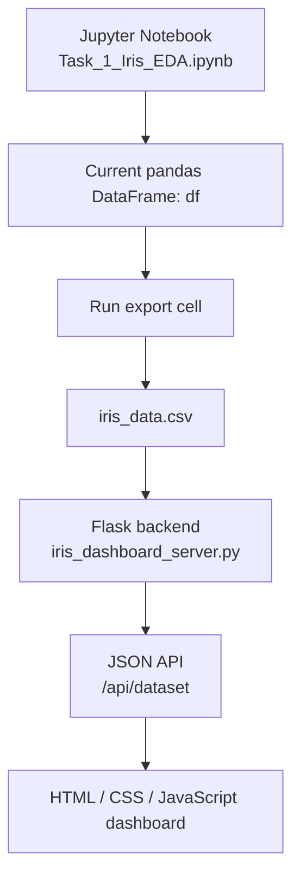

# 🌸 IrisLab — Bloom & Explore

> An interactive, flower-themed Exploratory Data Analysis dashboard for the classic Iris dataset.


---

## 🌷 Table of Contents

- [Overview](#-overview)
- [Features and Visualizations](#-features-and-visualizations)
- [Technology Stack](#-technology-stack)
- [How the Application Works](#-how-the-application-works)
- [Run Locally](#-run-locally)
- [Project Structure](#-project-structure)
- [Deploying Online](#-deploying-online)
- [Limitations and Next Steps](#-limitations-and-next-steps)
- [Learning Outcomes](#-learning-outcomes)

---

## 🌷 Overview

**IrisLab** is an interactive data-science portfolio project built around the classic Iris flower dataset. It combines a Jupyter notebook for analysis with a browser-based dashboard served by a Python/Flask backend.

The notebook serves as the analysis workspace, while the dashboard acts as the presentation layer. A CSV file bridges the notebook's in-memory DataFrame and the web application.

---

## 🚀 Features and Visualizations

1. **Dataset Overview**: Displays observation counts, feature counts, species distribution, missing values, and sample records.
2. **Scatter Plots**: Compares sepal and petal dimensions, with points distinguished by species to reveal clusters and overlaps.
3. **Histograms**: Inspects the distributions and spreads of all four flower measurements.
4. **Box Plots**: Compares central tendencies, variability, and potential outliers across species.
5. **Correlation Heatmap**: Highlights linear associations among numeric measurements.
6. **Pairplot**: Provides a multivariate view of pairwise relationships.
7. **Concluding Remarks**: Summarizes dataset findings and feature separations.

---

## 🛠️ Technology Stack

| Technology | Where it is Used | Why it was Chosen |
|---|---|---|
| **Python** | Notebook & Backend | Core language for analysis and logic. |
| **Jupyter Notebook** | Analysis workspace | Keeps analysis steps and code reproducible. |
| **Pandas / NumPy** | Data processing | Simplifies tabular cleaning and numerical ops. |
| **Matplotlib / Seaborn** | Visualizations | Provides flexible statistical plotting. |
| **Flask** | Backend server | Serves the dashboard and JSON API lightweight. |
| **HTML / CSS / JS** | Frontend dashboard | Creates the browser interface and interactivity. |

---

## 🔄 How the Application Works



---

## 💻 Run Locally

### 1. Clone the Repository
```powershell
git clone https://github.com/YOUR-USERNAME/irislab-bloom-explore.git
cd irislab-bloom-explore
```

### 2. Set Up a Virtual Environment
```powershell
py -m venv .venv
.\.venv\Scripts\Activate.ps1
```

### 3. Install Dependencies
```powershell
py -m pip install -r requirements_iris_dashboard.txt
```

### 4. Export Data & Run the Server
1. Open `Task_1_Iris_EDA.ipynb`, run all cells, and execute the final **Publish the live dashboard dataset** cell to generate `iris_data.csv`.
2. Start the Flask backend:
   ```powershell
   py iris_dashboard_server.py
   ```
3. Open **http://127.0.0.1:5000** in your browser.

---

## 🗂️ Project Structure

```text
irislab-bloom-explore/
├── README.md
├── Task_1_Iris_EDA.ipynb
├── irislab_frontend_connected.html
├── iris_dashboard_server.py
├── requirements_iris_dashboard.txt
└── iris_data.csv                 # Generated from the notebook
```

---

## 🚀 Deploying Online

GitHub Pages only hosts static files and cannot run the Flask/Python backend. To deploy publicly, host the backend on a Python-capable web service, configure environment dependencies, and ensure the frontend connects to the deployed API URL.

---

## ⚠️ Limitations and Next Steps

- CSV export is a manual bridge between the notebook and backend.
- The dataset is small and clean; real-world data requires robust validation.
- Correlation describes association, not causality.

---

## 🌻 Learning Outcomes

Demonstrates a full workflow connecting data loading, exploratory analysis, species-level comparisons, a Flask JSON API, a browser frontend, and reproducible project documentation.

---

<div align="center">

Made for learning, exploration, and data storytelling 🌷  
*Star this repository if you find it helpful!*

</div>
